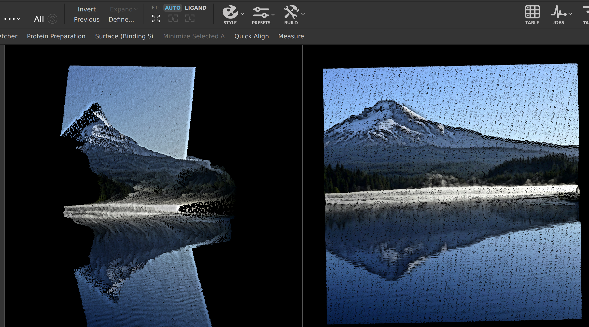
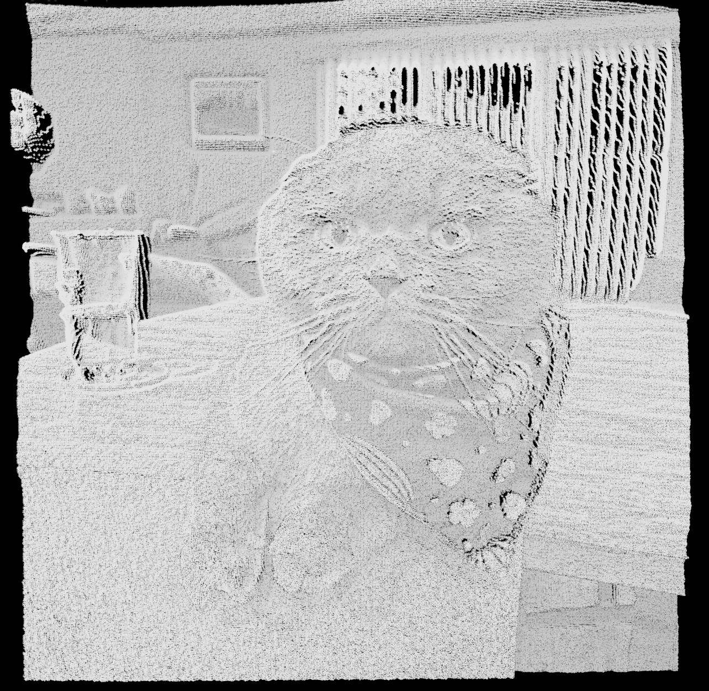

# photo2mae
For art, nothing scientific about it. 

Generate a mae file from a photo (png, jpg).

Requires pillow (pip install pillow)

Check --help for usage

## Results

| Maestro GIF |
| :---: |

